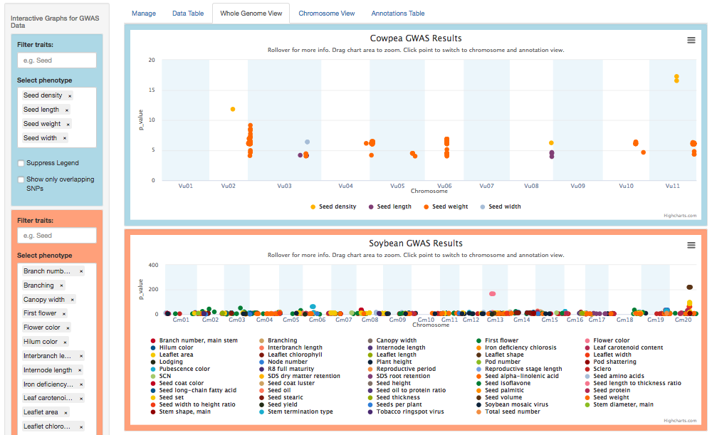
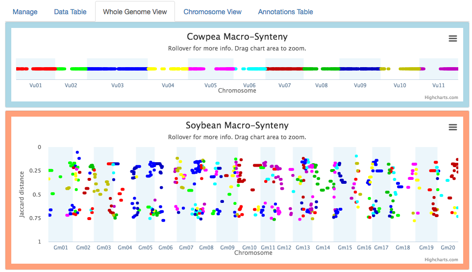
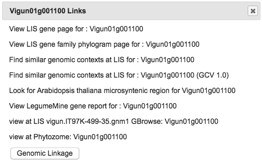
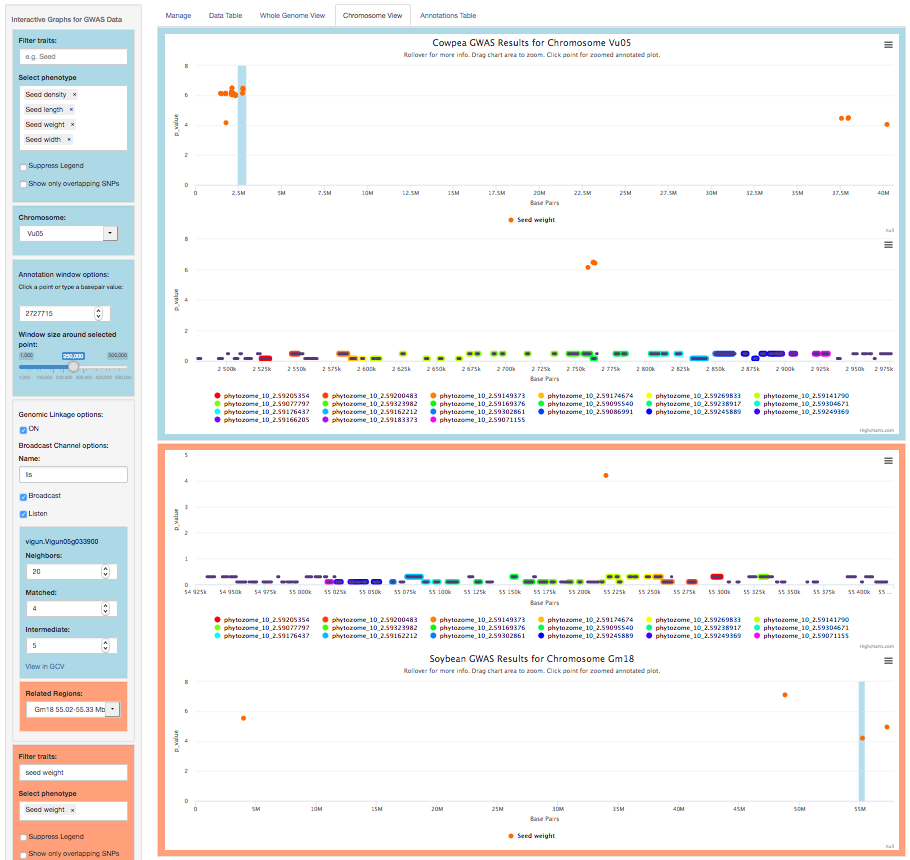
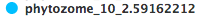
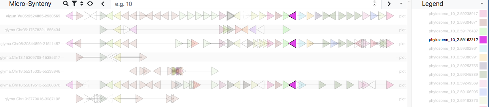
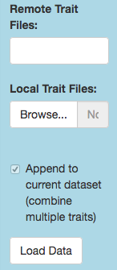
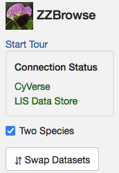

# ZZBrowse

ZZBrowse is an interactive R/Shiny web application for GWAS visualization. Here we describe our enhancements to the original [ZBrowse](https://github.com/baxterlabZbrowse/ZBrowse) developed by the [Baxter Laboratory](https://www.baxterlab.org/untitled-cqi0).

These wiki pages serve as a user manual:

- [Setup](https://github.com/legumeinfo/ZZBrowse/wiki/Setup)
- [Usage](https://github.com/legumeinfo/ZZBrowse/wiki/Usage-(from-original-ZBrowse)) (from original ZBrowse)
- [Add a dataset](https://github.com/legumeinfo/ZZBrowse/wiki/Add-a-dataset) (in ZZBrowse)

### Comparative GWAS Visualization

Each ZZBrowse view now supports simultaneous visualization of GWAS data for two species, with Species 1 (here, cowpea) framed in blue and Species 2 (soybean) in orange.

### Macrosynteny blocks

The Whole Genome and Chromosome views now plot macrosynteny blocks v. a syntenic distance metric (Levenshtein or Jaccard), for the purpose of quickly identifying likely related regions of the two genomes to explore further, using the Genomic Linkage feature described below. The other macrosynteny options (at the bottom of the sidebar) are described [here](https://github.com/legumeinfo/ZZBrowse/wiki/Macro-Synteny-options).

### Linkouts and Genomic Linkages

In the Chromosome view, clicking on a gene pops up a menu of linkouts. Click any of these to open its link in a new window.

For Species 1, the menu also has a Genomic Linkage option. Clicking this calls the Genome Context Viewer to identify similar regions in Species 2, defined by the number of matching and non-matching neighboring genes. Matching genes are color-coded by gene family in rainbow order (relative to their Species 1 sequence), illustrating the degree of synteny between the two species. If more than one similar region exists in Species 2, the Related Regions menu lets you choose which one to view.

In the example above, there is considerable synteny between regions of cowpea chromosome 5 (2.5-2.9 Mbp) and soybean chromosome 18 (55.0-55.3 Mbp). The GWAS data (Manhattan plots) show significant associations for seed weight in both regions.

### Communication with the Genome Context Viewer

The Genomic Linkage options (described [here](https://github.com/legumeinfo/ZZBrowse/wiki/Genomic-Linkage-options)) enable communication between ZZBrowse and the Genome Context Viewer (GCV). For example, when Broadcast is enabled, clicking a gene family legend item like  highlights genes belonging to that family in the GCV. Similarly, when Listen is enabled, mousing over an item in the GCV highlights the corresponding item(s) in ZZBrowse.

The Show in GCV link tells the GCV to focus on the same region of the Species 1 genome displayed in ZZBrowse.

### Other New Features

#### Importing local GWAS data

 The original ZBrowse allowed loading your own local GWAS data files, but assigned each to a new, standalone dataset. Our implementation does not create new datasets on the fly, but instead adds user data to existing ones. We hope this feature will benefit researchers desiring to superimpose their own bleeding-edge GWAS data on previously published results.

We provide GWAS datasets for common bean, cowpea, peanut, pigeonpea, and soybean, while the _Medicago truncatula_ and _Arabidopsis thaliana_ datasets are initially empty (a few traits are available through the Remote Trait Files selector).

To add your own local GWAS data, first prepare them as a delimited text file with a header row listing the column names. Required columns are chromosome, position, trait (= phenotype), and p-value (or other significance metric) for each SNP, but you may include others. Click the Local Trait Files/Browse button to specify which file(s) to load, then click the Load Data button to append the GWAS data. Finally, tweak any details (such as whether to take the negative logarithm of the reported p-value) through the Manage tab.

#### Importing local QTL data

We provide a QTL dataset for cowpea. To add your own QTL data, prepare a similar delimited text file as for GWAS data, but including columns for start and end position of the QTL interval. In the position column, put the center position of the interval.

#### Application state

The URL automatically reflects the current state of ZZBrowse, allowing you to easily save a result and replicate it later. For example, if you want to share an interesting genomic linkage with a colleague, just copy the current URL and paste it into an e-mail message. They can then launch ZZBrowse and recreate the same view.

#### Tour

The Start Tour link (in the Manage tab) launches a guided tour (or tutorial) of ZZBrowse.

#### Connection Status

This panel (also in the Manage tab) indicates when remote data sources are unavailable, relieving user angst.
